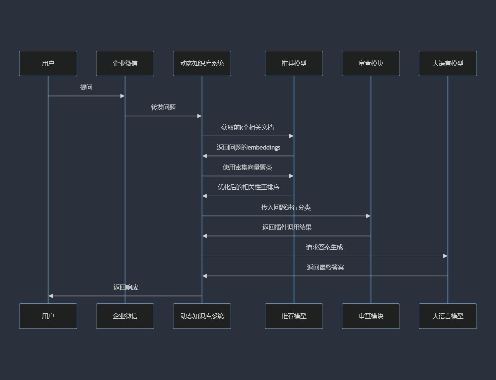

<h1>⚡️语义文档处理引擎</h1>

基于大语言模型实现，开源、可离线部署的轻量文档管理与检索文档方案。

### 目录

- [目录](#目录)
- [介绍](#介绍)
- [快速上手](#快速上手)
  - [1.环境配置](#1环境配置)
  - [2.模型下载](#2模型下载)
  - [3.初始化知识库和配置文件](#3初始化知识库和配置文件)
  - [4.启动项目程序](#4启动项目程序)
  - [5.注意事项](#5注意事项)
- [使用案例](#使用案例)
- [贡献指南](#贡献指南)
- [许可证](#许可证)
- [致谢](#致谢)

### 介绍

💡 受到项目 [Langchain-Chatchat](https://github.com/chatchat-space/Langchain-Chatchat) 的启发，实现了一个碎片化信息高效检索的方案。

项目使用 SQLite 作为轻量数据库进行文档和用户的管理，使用了 [facebookresearch/faiss](https://github.com/facebookresearch/faiss) 的高维度加速接口进行文件检索。本项目提供大量接口以供开发，部署轻便，现在支持企业微信应用的快速接入。



### 快速上手

#### 1.环境配置

- 推荐使用 Python 3.9.16 版本。
  
```bash
# 拉取仓库
$ git clone https://github.com/PluginsKers/SemanticDocEngine.git

# 进入目录
$ cd SemanticDocEngine

# 安装依赖
$ pip install -r requirements.txt

# 默认依赖包括基本运行环境（FAISS向量库）。
```

#### 2.模型下载

注意：大语言模型可选，仅仅使用文档管理就无需下载大语言模型。

以本项目中默认使用的大语言模型 [THUDM/ChatGLM3-6B](https://huggingface.co/THUDM/chatglm3-6b) 与 Embedding 模型 [BAAI/bge-m3](https://huggingface.co/BAAI/bge-m3) 为例：

下载模型需要先[安装 Git LFS](https://docs.github.com/zh/repositories/working-with-files/managing-large-files/installing-git-large-file-storage) ，然后运行

```bash
# 安装 lfs 组件
$ git lfs install

# 下载 THUDM/chatglm3-6b 模型
$ git clone https://huggingface.co/THUDM/chatglm3-6b

# 下载 BAAI/bge-m3 语义检索模型
$ git clone https://huggingface.co/BAAI/bge-m3

# 下载 BAAI/bge-reranker-large 排序模型
$ git clone https://huggingface.co/BAAI/bge-reranker-large
```

#### 3.初始化知识库和配置文件

将项目根目录下的 `config.py.template` 改名为 `config.py` 并且按照要求完善配置信息。

注意：本项目只有这一个配置文件。

#### 4.启动项目程序

在项目下运行：

```bash
# 运行主程序
$ python run.py
```

#### 5.注意事项

项目默认使用 GPU 加速，启动之前需要配置 `CUDA_VISIBLE_DEVICES` 参数。

```bash
# 仅使用 cuda:0 GPU进行推理加速
$ CUDA_VISIBLE_DEVICES=0 python run.py
```

在实验中，使用ChatGLM3-6B模型、BGE-M3检索模型和BGE-reranker-large重排序模型时需要至少14GB的显存。采用量化版本时，显存需求降至10GB。若不部署大语言模型，所需显存进一步减少至1GB以下。

### 使用案例

[documents-dashboard-web](https://github.com/PluginsKers/documents-dashboard-web) 实现了高效轻量化的前端显示方案。

### 贡献指南

我们欢迎所有形式的贡献，无论是新功能、bug修复，还是文档改进。请参阅 [CONTRIBUTING.md](./CONTRIBUTING.md) 了解如何开始贡献。

### 许可证

本项目采用 [Apache License 2.0](./LICENSE)，可以免费商用，无需付费。

### 致谢

感谢所有贡献者的辛勤工作以及 [Langchain-Chatchat](https://github.com/chatchat-space/Langchain-Chatchat) 项目的灵感。
